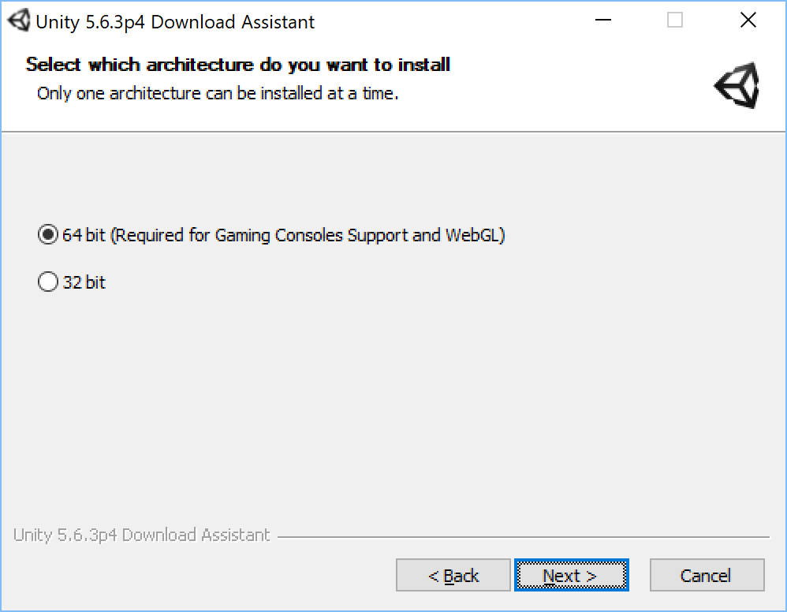
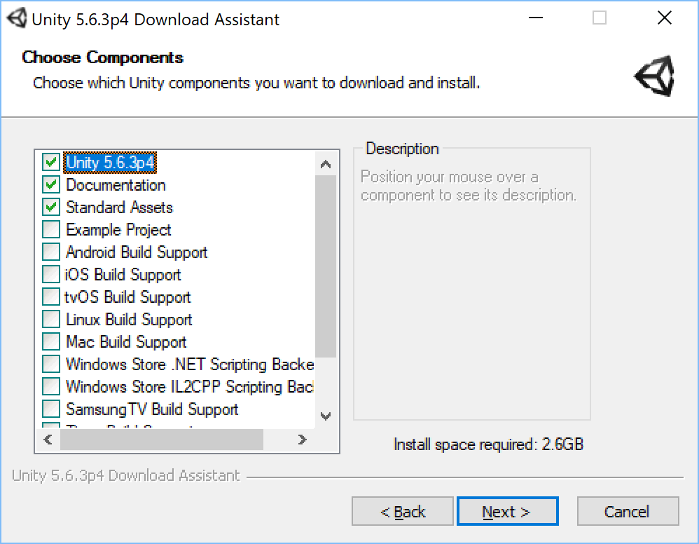
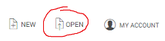
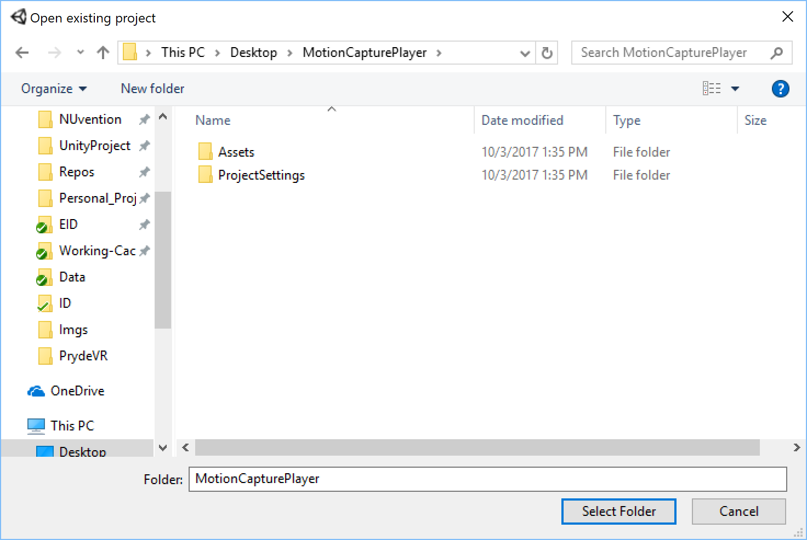
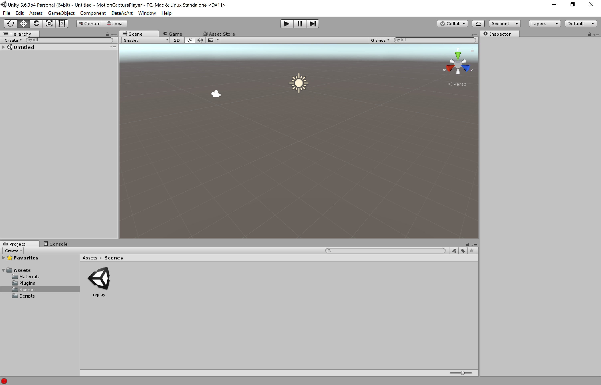
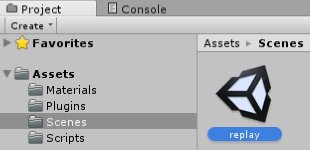
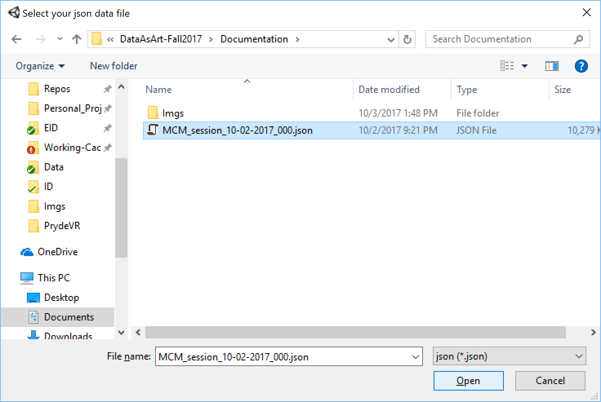
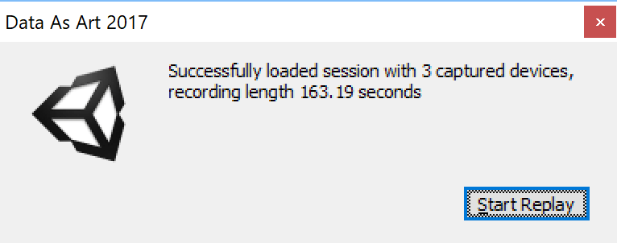
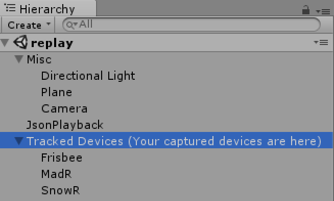
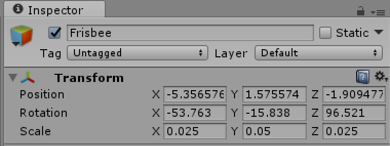

## Motion Capture Session Player v0.1
To help you visualize the captured session and get intuition of what the data looks like, I have build this motion capture session player in Unity.

Attached folder next to this readme file is a [Unity Engine](https://unity3d.com/) project. The following tutorial should help you setup the necessary environment in order to use the motion capture session player.

If you have any problem or question, please feel free to email me at [chenchen.bme@gmail.com](mailto:chenchen.bme@gmail.com).

This project and the Vive position capture code are both open source on GitHub. If you are interested, please find the link below:
- [Vive Motion Capture](https://github.com/chenchen2015/ViveMotionCapture/)
- [Vive Motion Capture Player](https://github.com/chenchen2015/ViveMotionCapturePlayer/)

## Quick Start
#### Install Unity Engine
If you don't have Unity Engine installed, please follow the steps below.

*If you already have a version of Unity, please make sure it's at least version 5.6 or above.*
1. Download Unity here [v5.6.3p4](https://beta.unity3d.com/download/fbe8bd37d7fa/UnityDownloadAssistant-5.6.3p4.exe)
    - If you would like to use the most recent version like 2017.1.1, feel free to do so.
2. Choose 64bit version (if it's available)
    
3. You only need the top three components for this
    
4. Finish the installation

#### Load project
1. Locate the project folder next to this file **/MotionCapturePlayer/**
2. Launch Unity
3. Click open and locate the **/MotionCapturePlayer/** folder
   
   then
   
4. Click **Select Folder**. If it promopt you any warning window, just click **Continue**

#### Load Scene and Start Playback
1. Now you should have the project loaded. It will look similar to the example below. Note that if you see some random error message shown in the *Console* tab, it's completely normal, just ignore them or click *Clear*.
   
2. Find **Project** tab and locate the **replay** scene under *Assets/Scenes/*. Double click to load this scene.
   
3. Hit the play button to start the scene

   
4. You will see a pop-up window asking you to choose the session json data for replay. In this example, I'm going to choose **MCM_session_10-02-2017_000.json** by first finding the file and then double click it.
   
5. Once it finished loading the data, you will see a summary window
   
6. Click **Start Replay** to start the playback.

### Useful Controls
- You can pause/resume the playback at any moment by pressing the pause button.
- You can step forward the playback by first pause and then press the step button next to it.
- To find a good view point, go to the **scenes** tab. Press and hold the right click of your mouse and use **W/S/A/D** to navigate.
- You can find and locate each of your captured devices under the **Hierarchy** tab

  
  - Click any tracked device, you can read its position and rotation in realtime under the **Inspector** tab. Note that the *scale* is just for visual effects, it's not related to the actual captured object.

    
